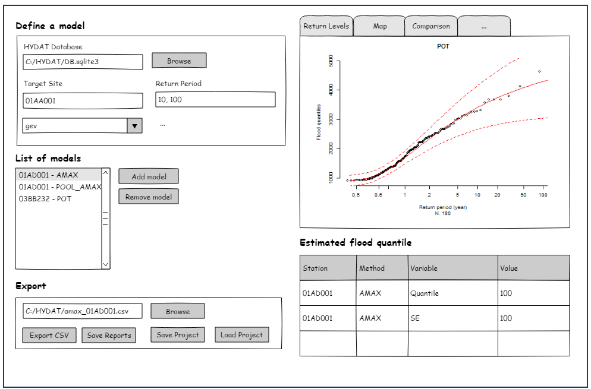

```{r setup, include=FALSE}
knitr::opts_chunk$set(echo = FALSE)
DB_HYDAT <- 'C:/Data/HYDAT_11AUG19/Hydat.sqlite3'
```

## Presentation plan

- Project structure
- Tools and Examples
- Graphical interface

## Project structure

- GitHub
  - [https://github.com/floodnetProject16/]()

- CSHShydRology (CRAN)
  - Target advanced users
  - Include basic numerical tools
  - Provide more options
  
- FloodnetProject16 (to be renamed)
  - Connect with HYDAT
  - Follow guidelines (automatic)
  - Graphical User Interface

- Extra (Aug 2019)

## What is covered?

- At-site flood frequency Analysis
  - Annual maximum discharge (AMAX)
  - Peaks over threshold (POT)
  
- Regional Frequency Analysis (RFA)
  - L-moment algorithm
  - Independent likelihood
  
- Prediction at ungauged basins
  - Quantile regression techniques (QRT)
  - Region of Influence + kriging

- Nonstationary

## Project Data

- 1114 studied stations

- Trend tests
  
- Super regions

- Candidate thresholds

- Descriptors


## Example

```{r, echo = FALSE, fig.width=8, fig.height = 5}
suppressPackageStartupMessages(library(floodnetProject16))

## Set colors for displaying the clusters
mycol <- c('#a6cee3','#1f78b4','#b2df8a','#33a02c','#fb9a99','#e31a1c',
                         '#fdbf6f','#ff7f00','#cab2d6','#6a3d9a','#ffff99','#b15928')
palette(mycol)

supreg <- gaugedSites$supreg_km12

layout(matrix(c(1,2), 1,2))
  
coord <- gaugedSites[,c('lon','lat')]

desc <- log(gaugedSites[,c('area','map')])

ucol <- sort(unique(supreg))
  
sp::plot(map_ca)
title(main = 'Geographical space')
axis(1)
axis(2)
legend('bottomleft', legend = '01AF009', pch = 13, col = 'black', bty = 'n', cex = 1.5)

points(coord, pch = 16, col = supreg, cex = .8)
points(coord[5,], pch = 13, cex = 2 )
  
legend('top', horiz = TRUE,legend = seq_along(ucol), col = ucol, 
             pch = rep(16,12), cex = .5)
  
plot(desc, pch = 16, col = supreg, 
           xlab = 'AREA (log)',
           ylab = 'MAP (log)',
           main = 'Descriptor space')

points(desc[5,], pch = 13, cex = 2 )

```

## Example

```{r echo = TRUE}
library(floodnetProject16)
library(CSHShydRology)

## Station of interest and path of the HYDAT database
mystation <- '01AF009'
myreg <- with(gaugedSites, 
              station[supreg_km12 == 11 & trend_mk > .05])

db <- 'C:/Data/HYDAT_11AUG19/Hydat.sqlite3'
```


## Example: Extract hydrometric data

- Similarity measure based on timing and regularity of the annual maximum events

```{r echo = TRUE}
sdist <- SeasonDistanceData(myreg, db) 
an <- AmaxData(myreg, db, target = mystation, 
               distance = sdist, size = 20)
```

---
```{r fig.height= 6, fig.width=6}
JulianPlot()
title(main = 'Seasonal space')
with(gaugedSites, points(season_x, season_y, pch = '+', cex = .5, col = 'darkgrey') )
sid <- gaugedSites$station %in% unique(an$station)
with(gaugedSites[sid,], points(season_x, season_y, pch = 16, col = '2', cex = .7) )
with(gaugedSites[5,], points(season_x, season_y, pch = 13, cex = 2) )

```

## Example: Performing RFA

```{r echo = TRUE, cache = TRUE}
set.seed(1)
FloodnetPool(an, mystation, period = c(10,100))
```


## Example : Performing RFA

- Using HYDAT
  - Connect to DB: `RSQLite`

- Using CSHShydRology
  - Reorganizing the data: `DataWide`.
  - Evaluate seasonality: `SeasonStat`, `SeasonDist`
  - Finding the pooling group: `FindNearest`.
  - Fitting the pooling group: `FitRegLmom`.
  - Updating the pooling group: `PoolRemove`.
  - Estimating intersite correlation: `Intersite`.
  - Evaluating flood quantiles: `predict` 

## Performing At-site frequency analysis using POT

- Same logic apply to the other frequency analysis

```{r, echo = TRUE, cache = TRUE}
set.seed(1)
out <- FloodnetPot('01AF009', db = db, area = 184, u = 20, 
                   period = 100, out.model = TRUE)
head(out$qua)
```

## Performing At-site frequency analysis using POT
```{r, echo = TRUE, fig.height=3.5, fig.width=5}
plot(out$fit, ci = TRUE)
```


## Example: Performing Prediction at ungauged basins

```{r echo = TRUE}
xd <- with(descriptors,
  data.frame(
      site = station,
    area = log(area),
    map  = log(map_ws),
    wb   = log(.01 + wb),
    stream = log(.01 + stream),
      elev = elev_ws,
      slope = log(.01 + slope)))

## split my sites
target.id <- (xd$site == mystation)
target <- xd[target.id,]
xd <- xd[-target.id,]

```

##  Example: Performing Prediction at ungauged basins

```{r, echo = TRUE, cache = TRUE}
set.seed(1)
FloodnetRoi(target = target, sites = xd, db = db, 
            period = 100, size = 30, nsim = 20, verbose = FALSE)
```

## Important functions

- Data: `AmaxData`, `DailyData`, `DailyPeaksData`

- At-site : `FloodnetAmax`, `FloodnetPot`.

- RFA : `FloodnetPool`, `FloodnetPoolMle`

- Ungauged: `FloodnetRoi`

## Graphical User Interface (GUI)

- Shiny Apps (web app)

- Features
     - Projects
     - Export CSV 
     - Reports*
     - Update DB*
     
- Graphics
  - Maps: descriptor and geographical space
  - Return levels plot
  - POT diagnostics
  - Comparison plot: Q100, CV

## Graphical User Interface (GUI)

<center>
  
</center>

## Extra

- Scripts for updating `gaugedSites`

- Analysis of the 1114 stations

## End

- Thanks

- [mdurocher@uwaterloo.ca]()

- [github.com/martindurocher/presentation_McMaster_dec19]()


